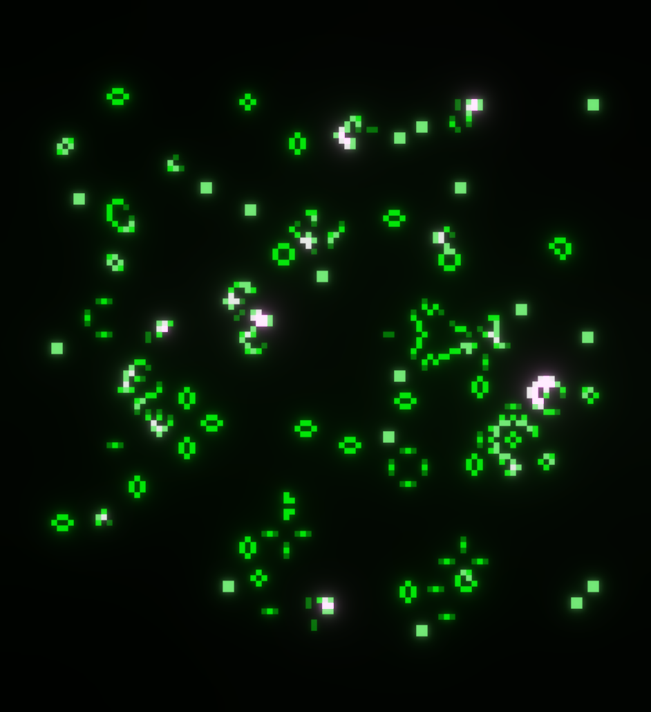

# game_of_life

A rust implementation of Conway's Game of Life in rust using the [bevy game engine](https://bevyengine.org/)!



How to run :
```bash
cargo run -r
```

- `Space` to generate a new random simulation
- `Click or touch` to add a cells
- `Esc` to escape the simulation

How to build for android :
```bash
cd app
cargo apk run
```
